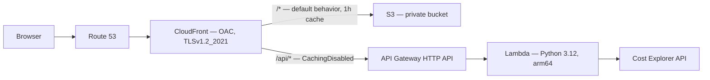

# AWS Cloud & DevOps Portfolio

Live infrastructure I'm building and documenting while transitioning into cloud and DevOps engineering. Everything here is provisioned with Terraform, deployed without static AWS credentials, and tested before being called done.

**Background:** 15+ years leading industrial infrastructure projects (PMP certified, $15M+ CAPEX managed) plus a recent Data Science specialization. This repo is the proof-of-work for the cloud/DevOps transition — each project is live, has a real URL, and this README explains what broke and why, not just what works.

## Live Projects

| # | Project | Status | Live URL | Primary skill |
|---|---|---|---|---|
| 1 | Serverless Cost Dashboard | ✅ Live | https://diegoestrada.cloud | Serverless architecture, boto3, cost engineering |
| 2 | Cloud Resume + OIDC CI/CD | ⬜ Not started | — | Identity federation, CI/CD security, IaC |
| 3 | EC2 Docker + Nginx | ⬜ Not started | — | Containers, Linux admin, reverse proxy |

This README covers Project 1 in detail. Projects 2 and 3 will get their own sections as they're built — see [terraform/modules/static_site/README.md](terraform/modules/static_site/README.md) for the static hosting module specifically.

## Project 1 — Serverless Cost Dashboard

### What it does and why

A live dashboard that queries my own AWS Cost Explorer data and shows gross spend, credits applied, net spend, remaining promotional credit balance, and a per-service breakdown for the current month. I built this first because cost awareness seemed like the most important habit to establish before building anything else on a credit-funded AWS account.

### Architecture



S3 is fully private; CloudFront reaches it through Origin Access Control (SigV4 signing), never OAI. The `/api/*` path gets its own cache behavior with caching disabled — without that override, CloudFront would serve a cached cost snapshot to every visitor for up to an hour using the default behavior's TTL.

### Repository structure

```
terraform/
  envs/prod/              # wires modules together, holds backend config
  modules/
    static_site/          # S3 + CloudFront + OAC (has its own README)
    http_api/              # API Gateway HTTP API + Lambda + IAM
src/lambda/cost/
  lambda_function.py      # Cost Explorer queries, structured logging, error handling
  tests/test_cost_handler.py   # 7 unit tests
frontend/
  index.html               # dashboard layout
  app.js                    # fetches /api/cost, renders the cards + table
scripts/
  bootstrap.sh              # one-time remote state setup (S3 + DynamoDB)
```

### Running and deploying

Prerequisites: AWS CLI v2, Terraform ≥1.9, Python 3.12, an AWS account with a named CLI profile (never static keys exported into the shell).

```bash
git clone https://github.com/daevestrada/aws-cloud-portfolio.git
cd aws-cloud-portfolio

# Run the Lambda unit tests
cd src/lambda/cost
pip install -r requirements.txt -t .
python -m pytest tests/ -v
cd ../../..

# Package the Lambda
cd src/lambda/cost
zip -r cost.zip lambda_function.py
cd ../../..

# Deploy
cd terraform/envs/prod
# create terraform.tfvars (gitignored) with your own values — see variables.tf
terraform init
terraform plan
terraform apply

# Deploy the frontend
aws s3 cp ../../../frontend/ s3://<site-bucket-name>/ --recursive
aws cloudfront create-invalidation --distribution-id <distribution-id> --paths "/*"
```

`terraform apply` redeploys Lambda code automatically when the zip changes — the resource has `source_code_hash = filebase64sha256(var.lambda_zip_path)` set specifically so Terraform detects content changes, not just filename changes.

### Key decisions

- **OAC, not OAI** — Origin Access Control uses SigV4 request signing and is the current AWS standard; Origin Access Identity is deprecated.
- **Route 53 A alias record, not CNAME** — CNAMEs aren't valid at a zone apex per RFC; an alias A record resolves dynamically to CloudFront without a fixed IP.
- **ACM certificate in us-east-1, no exceptions** — CloudFront is a global service that only reads ACM certificates from that region, independent of where every other resource lives.
- **Named AWS CLI profile for local dev, not a `.env` file with static keys** — fewer secrets on disk, nothing that can be accidentally committed.
- **Cost Explorer queried grouped by `[SERVICE, RECORD_TYPE]`, not `SERVICE` alone** — `UnblendedCost` nets promotional credits against usage at the service level; a service can silently disappear from a `SERVICE`-only breakdown even when real money moved.
- **`> 0.0001` threshold instead of `> 0`** — Cost Explorer returns floating-point residuals like `1e-10` that pass a naive positive filter and clutter the breakdown with effectively-zero line items.

### Key learnings (the debugging stories)

- **The credit-netting bug:** the dashboard showed `$0.00` for services that were genuinely costing money. `UnblendedCost` grouped only by `SERVICE` sums `Usage` and `Credit` record types together — when a promotional credit exactly offset a charge, the service vanished from the response even though real billing had occurred. Fixed by grouping on `[SERVICE, RECORD_TYPE]` and reporting gross usage separately from credits applied.
- **`logging.basicConfig()` silently does nothing in Lambda** — the Python runtime attaches its own handler to the root logger before user code runs, so `basicConfig()` without `force=True` is a no-op. `LOG_LEVEL` had been silently ignored since this was first written.
- **`TimePeriod.End` in Cost Explorer is exclusive** — every query was dropping the current day's data without erroring. Fixed with a helper that always queries through `today + 1 day`.
- **A correct deploy can still look broken** — after pushing a frontend update, the live page appeared stuck on "loading." `curl` confirmed S3/CloudFront had the new file; the browser was serving a stale cached copy. CloudFront invalidation and browser caching are independent problems.
- **There's no AWS API for "credits remaining."** The Billing Console's credit widget has no programmatic equivalent — `credits_remaining` is calculated from a manually calibrated baseline (read from the console) minus cumulative credit drawdown since that date, recalibrated whenever a new credit lands.

### Cost

Roughly $0.50/month fixed (Route 53 hosted zone) plus $0.01 per Cost Explorer API call. Comfortably inside the AWS credit available through September 2026.

### What's next

- [ ] Write actual pipeline logic for `.github/workflows/ci.yml` and `terraform-deploy.yml` — both exist as empty (0 KB) placeholder files from initial repo scaffolding; no CI/CD has been implemented yet
- [ ] Write `docs/adr/0001`–`0004` as standalone files (currently only exist as PR descriptions)
- [ ] Write the pending `docs/runbook.md` entries (Cost Explorer's per-call cost, the logging no-op, `TimePeriod.End` exclusivity, browser cache vs. invalidation)
- [ ] Give `/api/cost` a real TTL instead of `CachingDisabled` — Cost Explorer costs money per call, and an hour-long cache would still serve fresh-enough data
- [ ] Project 2 — Cloud Resume with GitHub Actions OIDC (zero static credentials in CI)
- [ ] Project 3 — EC2 + Docker + Nginx, automated container deploys

## License

MIT
